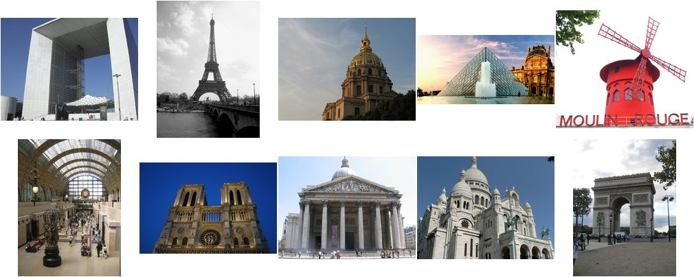
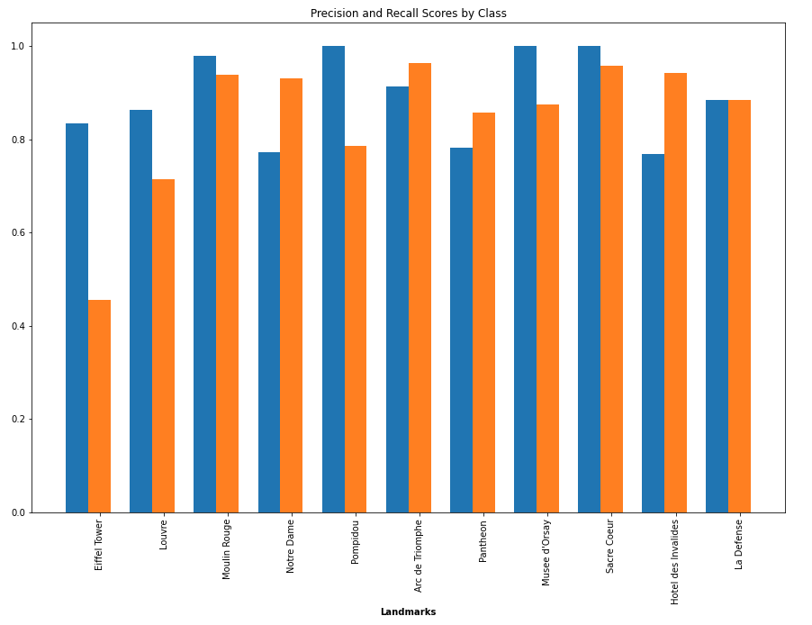

# Landmark recognition task

This repository contains a CNN that classifies landmarks. Classifier use pre-trained on the ImageNet database convolutional neural network VGG19 as a backbone. Network was trained on "Paris 6K" dataset and predict 11 classes whith 85% test accuracy. To download dataset and get more information about data [look here.](https://www.robots.ox.ac.uk/~vgg/data/parisbuildings/) 

## Requirements
+ TensorFlow>=2.4.1

## Results
Evaluation of precision and recall by classes

